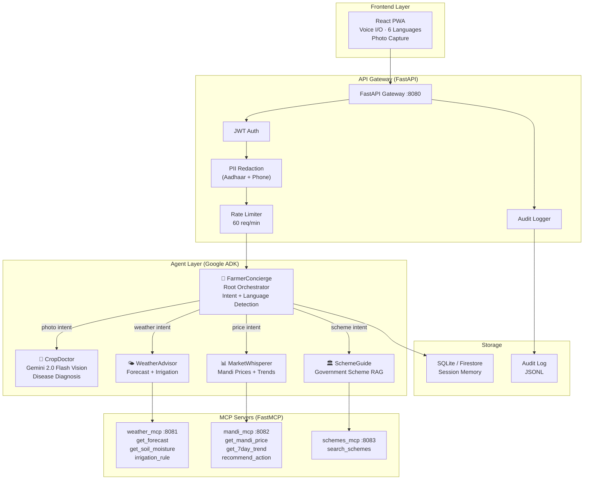
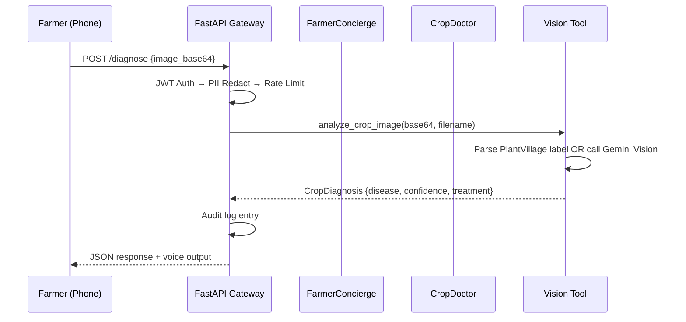
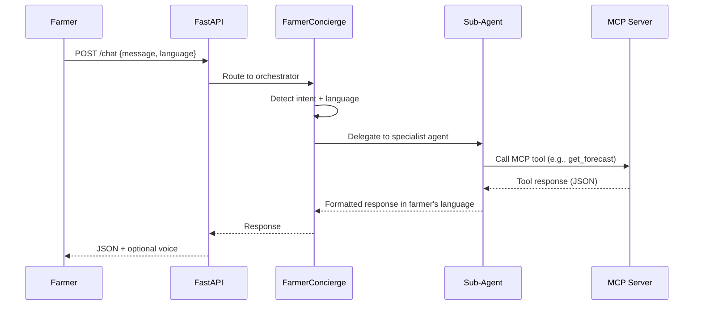

# AgriSaathi — Architecture

## System Architecture

## Tech Stack

| Component | Technology | Why This Choice |
|-----------|-----------|-----------------|
| Agent Framework | Google ADK (LlmAgent) | Native Gemini integration, sub-agent delegation, MCP toolset support |
| LLM | Gemini 2.0 Flash | Multimodal (vision + text), low latency, cost-effective |
| MCP Servers | FastMCP (Python MCP SDK) | Standard tool protocol, stdio + SSE transports, ADK-native integration |
| API Gateway | FastAPI + Uvicorn | Async, Pydantic validation, middleware stack, OpenAPI docs |
| Frontend | React 18 + Vite PWA | Mobile-first, offline-capable, installable on ₹8,000 phones |
| Styling | Vanilla CSS + Custom Properties | No build dependency, mobile-optimized, Lighthouse ≥ 90 |
| i18n | i18next + react-i18next | 6 languages (EN, HI, TA, TE, BN, MR), lazy-loaded translations |
| Voice I/O | Web Speech API | Zero-dependency, Chrome-optimized, multilingual BCP-47 support |
| Session Store | SQLite (dev) / Firestore (prod) | Async, persistent, swappable backends |
| Auth | JWT (dev) / Firebase Phone OTP (prod) | Zero-password auth for farmers with feature phones |
| IaC | Terraform | Cloud Run, Firestore, Secret Manager, IAM — all declarative |
| Containerization | Docker + Docker Compose | 5-service local stack, production-identical builds |
| Testing | pytest + ADK AgentEvaluator | Unit, integration, trajectory-based eval harness |
| Security | PII Redaction + Tool Isolation | Defense-in-depth: regex middleware + Pydantic __repr__ + agent-level constraints |

## Data Flow: Photo Diagnosis

## Data Flow: Text Chat

